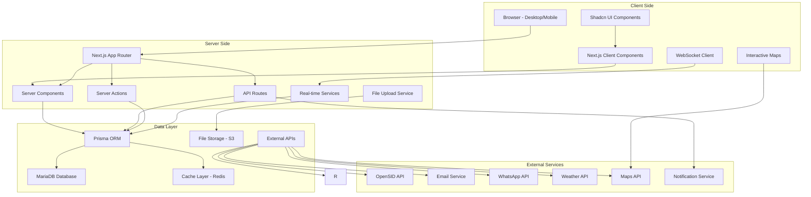

# Dokumen Desain Sistem Portal Web Kalurahan Pondokrejo

## Ringkasan

Portal Web Kalurahan Pondokrejo adalah aplikasi web berbasis Next.js 15 yang dirancang sebagai platform digital resmi Pemerintah Kalurahan Pondokrejo dengan **homepage interaktif dan canggih** yang menampilkan fitur-fitur modern seperti **SDGs Dashboard**, **Live Statistics**, **Interactive Map**, dan **Community Engagement Hub**. Sistem ini menggunakan arsitektur modern dengan App Router, Prisma ORM untuk database management, dan Shadcn UI untuk komponen user interface yang konsisten dan accessible.

### Teknologi Utama

- **Framework:** Next.js 15 (App Router, Server Actions, TypeScript)
- **Database:** MariaDB dengan Prisma ORM
- **UI Framework:** Tailwind CSS 4 + Shadcn UI
- **Authentication:** Auth.js
- **Validasi:** Zod
- **Deployment:** Production Environment di port 5090
- **Real-time:** WebSocket Connection untuk live statistics
- **Maps:** OpenStreetMap & Leaflet integration
- **Charts:** Recharts untuk data visualization
- **Animations:** Framer Motion untuk desktop interactions
- **File Upload:** AWS S3 compatible storage
- **Notifications:** Real-time toast & push notifications

## Arsitektur Sistem

### High-Level Architecture



### Enhanced Folder Structure

```
/app
  /layout.tsx              # Root layout dengan Header, Footer
  /page.tsx                # Enhanced homepage (hero, SDGs, statistics, map)
  /globals.css             # Global styles Tailwind

  /components              # Enhanced component structure
    /ui/custom/            # Custom components (Shadcn extensions)
      /SmartNotificationBar.tsx
      /AdvancedHeroSlider.tsx
      /SDGsDashboard.tsx
      /LiveStatistics.tsx
      /OfficersSlider.tsx
      /InteractiveMap.tsx
      /NewsSection.tsx
      /CommunityHub.tsx
      /DocumentCenter.tsx
    /layout/               # Layout components
      /Header.tsx
      /Footer.tsx
      /MobileNavigation.tsx
      /Sidebar.tsx
    /charts/               # Recharts components
      /SDGsProgressChart.tsx
      /StatisticsChart.tsx
      /FinancialChart.tsx
    /forms/                # Enhanced form components
      /ComplaintForm.tsx
      /SuggestionForm.tsx
      /VolunteerForm.tsx
      /ServiceForm.tsx
    /maps/                 # Map components
      /MapContainer.tsx
      /LocationMarker.tsx
      /SearchBox.tsx

  /hooks                   # Custom React hooks
    /useWebSocket.ts
    /useLiveStatistics.ts
    /useMapInteraction.ts
    /useTranslation.ts
    /useLocalStorage.ts

  /lib                     # Utility libraries
    /translation.json      # Indonesian translations
    /dateUtils.ts          # Indonesian date formatting
    /numberUtils.ts        # Indonesian number formatting
    /mapUtils.ts           # Map utility functions
    /notificationUtils.ts  # Notification helpers

  /api                     # Enhanced API routes
    /statistics            # Real-time statistics
    /map                   # Map data and interactions
    /notifications         # Push notifications
    /community             # Community features
    /weather               # Weather data
    /emergency             # Emergency alerts

  /admin                    # Admin panel routes
    /layout.tsx            # Admin layout dengan sidebar
    /dashboard/page.tsx    # Enhanced dashboard dengan analytics
    /sdgs                  # SDGs management
    /statistics            # Statistics management
    /community             # Community engagement management
    /map                   # Map management
    /notifications         # Notification management

  /berita                   # Enhanced public berita routes
    /page.tsx              # Berita list dengan filtering
    /[slug]/page.tsx       # Enhanced detail page dengan social sharing
    /category/[cat]/page.tsx # Category-based berita

  /profil                   # Enhanced profil kalurahan
    /sejarah/page.tsx      # Sejarah dengan virtual tour
    /visi-misi/page.tsx    # Visi & misi dengan progress tracking
    /struktur/page.tsx     # Struktur dengan contact cards
    /sdgs/page.tsx         # SDGs progress detail

  /layanan                  # Enhanced layanan mandiri
    /administrasi/page.tsx # Enhanced forms dengan tracking
    /surat/page.tsx        # Surat dengan e-signature
    /tracking/page.tsx     # Document tracking system

  /pemerintahan             # Enhanced pemerintahan kalurahan
  /informasi                # Enhanced informasi & pengumuman
  /keuangan                 # Enhanced laporan keuangan dengan charts
  /pembangunan              # Enhanced pembangunan dengan progress tracking
  /kegiatan                 # Enhanced kegiatan warga dengan registration
  /bumdes                   # Enhanced BUMDes dengan performance metrics
  /pengaduan                # Enhanced pengaduan dengan ticket system
  /kontak                   # Enhanced kontak dengan map integration
  /map                      # Interactive map page
  /community                # Community engagement pages
  /sdgs                     # SDGs progress pages
    /auth                   # Authentication endpoints
    /berita                 # Berita CRUD
    /layanan                # Layanan endpoints
    /opensid                # OpenSID proxy

/components                 # Reusable components
  /ui                      # Shadcn UI components
  /layout                  # Header, Footer, Sidebar
  /berita                  # Berita cards, lists
  /forms                   # Form components
  /charts                  # Recharts components
  /hero                    # Hero slider

/lib                        # Utility functions
  /prisma.ts               # Prisma client
  /auth.ts                 # Auth configuration
  /validation.ts           # Zod schemas
  /translation.json        # UI translations
  /utils.ts                # Helper functions

/prisma                     # Database schema
  /schema.prisma           # Database model
  /seed.ts                 # Seed data
  /migrations              # Database migrations
```

## UI/UX Design System & Implementation Rules

### Tema & Warna

**Theme:** Light theme only (no dark mode)

| Atribut        | Warna                           | Deskripsi                |
| -------------- | ------------------------------- | ------------------------ |
| **primary**    | `#39a2cf`                       | Biru utama resmi (Header)|
| **secondary**  | `#3eafdf`                       | Biru kebiruan pendukung  |
| **background** | `#f2f6ff`                       | Dasar halaman bersih     |
| **surface**    | `#ffffff`                       | Latar kartu/komponen     |
| **text-dark**  | `#000000`                       | Teks utama               |
| **text-light** | `#ffffff`                       | Teks di atas latar gelap |
| **text-hover** | `#ddf0ff`                       | Teks hover di atas gelap |
| **accent**     | `#0a4661`                       | Warna aksen/CTA (Footer)  |
| **success**    | `#22c55e`                       | Status sukses            |
| **warning**    | `#fbbf24`                       | Peringatan               |
| **danger**     | `#f87171`                       | Kesalahan                |
| **info**       | `#60a5fa`                       | Informasi                |
| **hover**      | `#08374c`, `#08374c`, `#ddf0ff` | Hover states             |
| **decoration** | `#99c2eb`                       | Dekorasi                 |

### Spacing & Layout Rules

- **Padding & Margin:** Maksimum `p-4` atau `m-4`
- **Card Spacing:** Jarak antar card/kartu = 20px
- **Grid Gap:** 20px untuk semua grid layouts

### Component Implementation Rules

### ⚠️ **PENTING: Aturan Shadcn UI Components**

#### **Shadcn Original Components - TIDAK BOLEH DIUBAH**

```bash
# Folder ini DILARANG keras untuk dimodifikasi
/components/ui/
├── button.tsx          # ← JANGAN DIUBAH
├── input.tsx           # ← JANGAN DIUBAH
├── select.tsx          # ← JANGAN DIUBAH
├── textarea.tsx        # ← JANGAN DIUBAH
├── dialog.tsx          # ← JANGAN DIUBAH
├── table.tsx           # ← JANGAN DIUBAH
├── badge.tsx           # ← JANGAN DIUBAH
├── tabs.tsx            # ← JANGAN DIUBAH
├── dropdown-menu.tsx   # ← JANGAN DIUBAH
├── context-menu.tsx    # ← JANGAN DIUBAH
├── toast.tsx           # ← JANGAN DIUBAH
├── alert-dialog.tsx    # ← JANGAN DIUBAH
└── ...semua file lainnya # ← JANGAN DIUBAH
```

#### **Custom Components - BUAT DI FOLDER TERPISAH**

```bash
# Folder untuk custom components
/components/ui/custom/
├── CustomButton.tsx        # ← Extended button dengan icon, loading, tooltip
├── CustomInput.tsx         # ← Input dengan icon dan error handling
├── CustomSelect.tsx        # ← Select dengan custom styling
├── CustomBadge.tsx         # ← Badge dengan icon dan variant kustom
├── CustomContextMenu.tsx   # ← Context menu dengan separator
├── CustomDataTable.tsx     # ← Table dengan pagination dan context menu
├── CustomTabs.tsx          # ← Tabs dengan mobile dropdown
├── CustomModal.tsx         # ← Modal dengan custom behavior
├── AnimatedSection.tsx     # ← Animasi untuk desktop only
└── CustomToast.tsx         # ← Toast configuration kustom
```

#### **Contoh Implementasi Custom Component**

```typescript
// components/ui/custom/CustomButton.tsx
import { Button } from "@/components/ui/button";
import { Loader2 } from "lucide-react";
import { cn } from "@/lib/utils";

interface CustomButtonProps {
  variant?: 'default' | 'outline' | 'destructive' | 'secondary' | 'ghost' | 'link';
  size?: 'default' | 'sm' | 'lg' | 'icon';
  icon?: LucideIcon;
  loading?: boolean;
  tooltip?: string;
  children: React.ReactNode;
  className?: string;
}

export const CustomButton = ({
  variant = 'outline',
  size = 'default',
  icon: Icon,
  loading = false,
  tooltip,
  children,
  className,
  ...props
}: CustomButtonProps) => {
  // Extend Shadcn Button tanpa memodifikasi original file
  const buttonContent = (
    <Button
      variant={variant}
      size={size}
      className={cn(className)}
      disabled={loading}
      {...props}
    >
      {loading && <Loader2 className="mr-2 h-4 w-4 animate-spin" />}
      {Icon && <Icon className="mr-2 h-4 w-4" />}
      {children}
    </Button>
  );

  // Wrap dengan tooltip jika needed
  if (tooltip && (!children || (Icon && !children))) {
    return (
      <TooltipProvider>
        <Tooltip>
          <TooltipTrigger asChild>
            {buttonContent}
          </TooltipTrigger>
          <TooltipContent>
            <p>{tooltip}</p>
          </TooltipContent>
        </Tooltip>
      </TooltipProvider>
    );
  }

  return buttonContent;
};
```

#### **Import Pattern**

```typescript
// ✅ BENAR: Import dari custom components
import { CustomButton } from "@/components/ui/custom/CustomButton";
import { CustomInput } from "@/components/ui/custom/CustomInput";

// ❌ SALAH: Jangan langsung import Shadcn untuk extended functionality
// import { Button } from "@/components/ui/button"; // Hanya untuk basic usage

// ✅ BENAR: Import Shadcn untuk basic usage tanpa modifikasi
import { Card, CardContent, CardHeader, CardTitle } from "@/components/ui/card";
```

#### **Alasan Aturan Ini**

1. **Maintainability**: Shadcn UI updates tidak akan conflict dengan custom changes
2. **Version Control**: Mudah tracking perubahan custom vs original
3. **Reusability**: Custom components dapat digunakan di multiple projects
4. **Debugging**: Jelas membedakan antara original dan custom behavior
5. **Updates**: Safe untuk update Shadcn UI tanpa kehilangan custom features

#### Logo Component

```typescript
const LogoComponent = () => {
  return (
    <div className="w-full flex justify-start">
      
    </div>
  );
};
```

#### Button Implementation

```typescript
interface ButtonProps {
  variant?: 'default' | 'outline' | 'destructive' | 'secondary' | 'ghost' | 'link';
  size?: 'default' | 'sm' | 'lg' | 'icon';
  icon?: LucideIcon;
  loading?: boolean;
  tooltip?: string;
  children: React.ReactNode;
}

const CustomButton = ({
  variant = 'outline',
  size = 'default',
  icon: Icon,
  loading = false,
  tooltip,
  children,
  ...props
}: ButtonProps) => {
  const buttonContent = (
    <Button variant={variant} size={size} {...props}>
      {loading && <Loader2 className="mr-2 h-4 w-4 animate-spin" />}
      {Icon && <Icon className="mr-2 h-4 w-4" />}
      {children}
    </Button>
  );

  if (tooltip && (!children || (Icon && !children))) {
    return (
      <TooltipProvider>
        <Tooltip>
          <TooltipTrigger asChild>
            {buttonContent}
          </TooltipTrigger>
          <TooltipContent>
            <p>{tooltip}</p>
          </TooltipContent>
        </Tooltip>
      </TooltipProvider>
    );
  }

  return buttonContent;
};
```

#### Input Field Implementation

```typescript
interface InputFieldProps {
  label: string;
  icon: LucideIcon;
  placeholder: string;
  type?: 'text' | 'email' | 'password' | 'number';
  error?: string;
  required?: boolean;
}

const InputField = ({
  label,
  icon: Icon,
  placeholder,
  type = 'text',
  error,
  required = false
}: InputFieldProps) => {
  return (
    <div className="space-y-2">
      <Label htmlFor={label.toLowerCase()} className="flex items-center gap-2">
        {label}
        {required && <span className="text-destructive">*</span>}
      </Label>
      <div className="relative">
        <Icon className="absolute left-3 top-1/2 transform -translate-y-1/2 h-4 w-4 text-muted-foreground" />
        <Input
          id={label.toLowerCase()}
          type={type}
          placeholder={placeholder}
          className="pl-10"
          aria-invalid={!!error}
        />
      </div>
      {error && (
        <p className="text-sm text-destructive flex items-center gap-1">
          <AlertCircle className="h-4 w-4" />
          {error}
        </p>
      )}
    </div>
  );
};
```

#### Select/Dropdown Implementation

```typescript
interface SelectFieldProps {
  label: string;
  placeholder: string;
  options: { value: string; label: string }[];
  value?: string;
  onValueChange: (value: string) => void;
  error?: string;
}

const SelectField = ({
  label,
  placeholder,
  options,
  value,
  onValueChange,
  error
}: SelectFieldProps) => {
  return (
    <div className="space-y-2">
      <Label>{label}</Label>
      <Select value={value} onValueChange={onValueChange}>
        <SelectTrigger className="w-full text-left">
          <SelectValue placeholder={placeholder} />
        </SelectTrigger>
        <SelectContent>
          {options.map((option) => (
            <SelectItem
              key={option.value}
              value={option.value}
              className="text-left flex justify-between items-center"
            >
              <span>{option.label}</span>
              {value === option.value && (
                <Check className="h-4 w-4 text-primary ml-auto" />
              )}
            </SelectItem>
          ))}
        </SelectContent>
      </Select>
      {error && (
        <p className="text-sm text-destructive flex items-center gap-1">
          <AlertCircle className="h-4 w-4" />
          {error}
        </p>
      )}
    </div>
  );
};
```

#### Textarea Implementation

```typescript
interface TextareaFieldProps {
  label: string;
  placeholder: string;
  value?: string;
  onChange: (value: string) => void;
  error?: string;
  rows?: number;
}

const TextareaField = ({
  label,
  placeholder,
  value,
  onChange,
  error,
  rows = 8
}: TextareaFieldProps) => {
  return (
    <div className="space-y-2">
      <Label htmlFor={label.toLowerCase()}>{label}</Label>
      <Textarea
        id={label.toLowerCase()}
        placeholder={placeholder}
        value={value}
        onChange={(e) => onChange(e.target.value)}
        rows={rows}
        className="resize-y min-h-[200px]"
        aria-invalid={!!error}
      />
      {error && (
        <p className="text-sm text-destructive flex items-center gap-1">
          <AlertCircle className="h-4 w-4" />
          {error}
        </p>
      )}
    </div>
  );
};
```

#### Tabs Implementation

```typescript
interface TabsContainerProps {
  tabs: { value: string; label: string; content: React.ReactNode }[];
  defaultValue?: string;
  className?: string;
}

const TabsContainer = ({ tabs, defaultValue, className }: TabsContainerProps) => {
  return (
    <div className={`hidden md:block ${className}`}>
      <Tabs defaultValue={defaultValue || tabs[0]?.value}>
        <TabsList className="grid w-full grid-cols-4">
          {tabs.map((tab) => (
            <TabsTrigger key={tab.value} value={tab.value} className="text-center">
              {tab.label}
            </TabsTrigger>
          ))}
        </TabsList>
        {tabs.map((tab) => (
          <TabsContent key={tab.value} value={tab.value} className="mt-6">
            {tab.content}
          </TabsContent>
        ))}
      </Tabs>
    </div>
  );
};

// Mobile version - using Select dropdown
const TabsMobile = ({ tabs, defaultValue, className }: TabsContainerProps) => {
  const [activeTab, setActiveTab] = useState(defaultValue || tabs[0]?.value);

  return (
    <div className={`md:hidden ${className}`}>
      <Select value={activeTab} onValueChange={setActiveTab}>
        <SelectTrigger>
          <SelectValue />
        </SelectTrigger>
        <SelectContent>
          {tabs.map((tab) => (
            <SelectItem key={tab.value} value={tab.value}>
              {tab.label}
            </SelectItem>
          ))}
        </SelectContent>
      </Select>
      <div className="mt-4">
        {tabs.find(tab => tab.value === activeTab)?.content}
      </div>
    </div>
  );
};
```

#### Badge Implementation

```typescript
interface BadgeProps {
  variant?: 'default' | 'secondary' | 'destructive' | 'outline';
  icon?: LucideIcon;
  children: React.ReactNode;
}

const CustomBadge = ({ variant = 'default', icon: Icon, children }: BadgeProps) => {
  const variantColors = {
    default: 'bg-primary text-primary-foreground',
    secondary: 'bg-secondary text-secondary-foreground',
    destructive: 'bg-destructive text-destructive-foreground',
    outline: 'text-foreground',
    success: 'bg-green-100 text-green-800 border-green-200',
    warning: 'bg-yellow-100 text-yellow-800 border-yellow-200',
    info: 'bg-blue-100 text-blue-800 border-blue-200'
  };

  return (
    <Badge
      variant={variant === 'success' || variant === 'warning' || variant === 'info' ? 'outline' : variant}
      className={`${variantColors[variant as keyof typeof variantColors] || ''} flex items-center gap-1`}
    >
      {Icon && <Icon className="h-3 w-3" />}
      {children}
    </Badge>
  );
};
```

#### Context Menu Implementation

```typescript
interface ContextMenuItem {
  label: string;
  icon: LucideIcon;
  onClick: () => void;
  variant?: 'default' | 'destructive';
  separator?: boolean;
}

const CustomContextMenu = ({ items, children }: {
  items: ContextMenuItem[];
  children: React.ReactNode;
}) => {
  return (
    <ContextMenu>
      <ContextMenuTrigger>{children}</ContextMenuTrigger>
      <ContextMenuContent>
        {items.map((item, index) => (
          <React.Fragment key={index}>
            {item.separator && <ContextMenuSeparator />}
            <ContextMenuItem
              onClick={item.onClick}
              className={item.variant === 'destructive' ? 'text-destructive' : ''}
            >
              <item.icon className="mr-2 h-4 w-4" />
              {item.label}
            </ContextMenuItem>
          </React.Fragment>
        ))}
      </ContextMenuContent>
    </ContextMenu>
  );
};
```

#### Mobile Navigation

```typescript
const MobileNavigation = () => {
  const [isSidebarOpen, setIsSidebarOpen] = useState(false);

  const mainMenuItems = [
    { label: 'Beranda', href: '/', icon: Home },
    { label: 'Berita', href: '/berita', icon: Newspaper },
    { label: 'Layanan', href: '/layanan', icon: FileText },
    { label: 'Pengaduan', href: '/pengaduan', icon: MessageSquare },
  ];

  const sidebarItems = [
    { label: 'Profil Kalurahan', href: '/profil', icon: Users },
    { label: 'Pemerintahan', href: '/pemerintahan', icon: Building },
    { label: 'Informasi', href: '/informasi', icon: Info },
    { label: 'Keuangan', href: '/keuangan', icon: DollarSign },
    { label: 'Pembangunan', href: '/pembangunan', icon: Hammer },
    { label: 'Kegiatan', href: '/kegiatan', icon: Calendar },
    { label: 'BUMDes', href: '/bumdes', icon: Briefcase },
    { label: 'Kontak', href: '/kontak', icon: Phone },
  ];

  return (
    <>
      {/* Bottom Navigation */}
      <div className="md:hidden fixed bottom-0 left-0 right-0 bg-background border-t z-50">
        <div className="grid grid-cols-5 h-16">
          {mainMenuItems.map((item) => (
            <Link
              key={item.label}
              href={item.href}
              className="flex flex-col items-center justify-center gap-1 text-xs text-muted-foreground hover:text-foreground transition-colors"
            >
              <item.icon className="h-5 w-5" />
              <span>{item.label}</span>
            </Link>
          ))}
          <button
            onClick={() => setIsSidebarOpen(true)}
            className="flex flex-col items-center justify-center gap-1 text-xs text-muted-foreground hover:text-foreground transition-colors"
          >
            <Menu className="h-5 w-5" />
            <span>Lainnya</span>
          </button>
        </div>
      </div>

      {/* Sidebar */}
      <Sheet open={isSidebarOpen} onOpenChange={setIsSidebarOpen}>
        <SheetContent side="right" className="w-64">
          <SheetHeader>
            <SheetTitle>Menu Navigasi</SheetTitle>
          </SheetHeader>
          <div className="mt-6 space-y-2">
            {sidebarItems.map((item) => (
              <Link
                key={item.label}
                href={item.href}
                onClick={() => setIsSidebarOpen(false)}
                className="flex items-center gap-3 px-3 py-2 text-sm rounded-md hover:bg-accent transition-colors"
              >
                <item.icon className="h-4 w-4" />
                {item.label}
              </Link>
            ))}
          </div>
        </SheetContent>
      </Sheet>
    </>
  );
};
```

### Tabel & Paginasi Implementation

#### Table Component

```typescript
interface TableColumn<T> {
  key: keyof T;
  label: string;
  render?: (value: any, item: T) => React.ReactNode;
}

interface DataTableProps<T> {
  data: T[];
  columns: TableColumn<T>[];
  pagination?: {
    page: number;
    pageSize: number;
    total: number;
    onPageChange: (page: number) => void;
    onPageSizeChange: (size: number) => void;
  };
  actions?: (item: T) => ContextMenuItem[];
}

function DataTable<T extends { id: string | number }>({
  data,
  columns,
  pagination,
  actions
}: DataTableProps<T>) {
  const [contextMenuState, setContextMenuState] = useState<{
    item: T | null;
    x: number;
    y: number;
  }>({ item: null, x: 0, y: 0 });

  const contextMenuItems: ContextMenuItem[] = actions ? [
    ...(actions(contextMenuState.item!) || []),
    { separator: true },
    {
      label: 'Refresh',
      icon: RefreshCw,
      onClick: () => setContextMenuState({ item: null, x: 0, y: 0 })
    }
  ] : [];

  return (
    <div className="space-y-4">
      {/* Table */}
      <div className="rounded-md border">
        <Table>
          <TableHeader>
            <TableRow>
              {columns.map((column) => (
                <TableHead key={String(column.key)}>
                  {column.label}
                </TableHead>
              ))}
              <TableHead className="w-[70px]">Aksi</TableHead>
            </TableRow>
          </TableHeader>
          <TableBody>
            {data.map((item, index) => (
              <TableRow
                key={item.id}
                className={index % 2 === 0 ? 'bg-background' : 'bg-muted/50'}
                onContextMenu={(e) => {
                  e.preventDefault();
                  setContextMenuState({ item, x: e.clientX, y: e.clientY });
                }}
              >
                {columns.map((column) => (
                  <TableCell key={String(column.key)}>
                    {column.render ?
                      column.render(item[column.key], item) :
                      String(item[column.key] || '-')
                    }
                  </TableCell>
                ))}
                <TableCell>
                  {actions && (
                    <CustomContextMenu items={actions(item)}>
                      <Button variant="ghost" size="icon">
                        <MoreHorizontal className="h-4 w-4" />
                      </Button>
                    </CustomContextMenu>
                  )}
                </TableCell>
              </TableRow>
            ))}
          </TableBody>
        </Table>
      </div>

      {/* Pagination */}
      {pagination && (
        <div className="flex items-center justify-between">
          <div className="flex items-center space-x-2">
            <p className="text-sm text-muted-foreground">
              Menampilkan {((pagination.page - 1) * pagination.pageSize) + 1} -{' '}
              {Math.min(pagination.page * pagination.pageSize, pagination.total)} dari{' '}
              {pagination.total} data
            </p>
            <Select
              value={String(pagination.pageSize)}
              onValueChange={(value) => pagination.onPageSizeChange(Number(value))}
            >
              <SelectTrigger className="w-[70px]">
                <SelectValue />
              </SelectTrigger>
              <SelectContent>
                {[10, 20, 30, 50, 100].map((size) => (
                  <SelectItem key={size} value={String(size)}>
                    {size}
                  </SelectItem>
                ))}
              </SelectContent>
            </Select>
          </div>

          <div className="flex items-center space-x-2">
            <Button
              variant="outline"
              size="icon"
              onClick={() => pagination.onPageChange(1)}
              disabled={pagination.page === 1}
            >
              <ChevronsLeft className="h-4 w-4" />
            </Button>
            <Button
              variant="outline"
              size="icon"
              onClick={() => pagination.onPageChange(pagination.page - 1)}
              disabled={pagination.page === 1}
            >
              <ChevronLeft className="h-4 w-4" />
            </Button>

            {/* Page numbers */}
            {getPageNumbers(pagination.page, Math.ceil(pagination.total / pagination.pageSize)).map((pageNum, index) => (
              <React.Fragment key={index}>
                {pageNum === '...' ? (
                  <span className="px-2">...</span>
                ) : (
                  <Button
                    variant={pageNum === pagination.page ? 'default' : 'outline'}
                    size="icon"
                    onClick={() => pagination.onPageChange(pageNum as number)}
                  >
                    {pageNum}
                  </Button>
                )}
              </React.Fragment>
            ))}

            <Button
              variant="outline"
              size="icon"
              onClick={() => pagination.onPageChange(pagination.page + 1)}
              disabled={pagination.page === Math.ceil(pagination.total / pagination.pageSize)}
            >
              <ChevronRight className="h-4 w-4" />
            </Button>
            <Button
              variant="outline"
              size="icon"
              onClick={() => pagination.onPageChange(Math.ceil(pagination.total / pagination.pageSize))}
              disabled={pagination.page === Math.ceil(pagination.total / pagination.pageSize)}
            >
              <ChevronsRight className="h-4 w-4" />
            </Button>
          </div>
        </div>
      )}

      {/* Global Context Menu */}
      {contextMenuState.item && (
        <ContextMenu
          open={!!contextMenuState.item}
          onOpenChange={() => setContextMenuState({ item: null, x: 0, y: 0 })}
        >
          <ContextMenuTrigger style={{
            position: 'fixed',
            left: contextMenuState.x,
            top: contextMenuState.y,
            width: 1,
            height: 1
          }} />
          <ContextMenuContent>
            {contextMenuItems.map((item, index) => (
              <React.Fragment key={index}>
                {item.separator && <ContextMenuSeparator />}
                <ContextMenuItem
                  onClick={item.onClick}
                  className={item.variant === 'destructive' ? 'text-destructive' : ''}
                >
                  <item.icon className="mr-2 h-4 w-4" />
                  {item.label}
                </ContextMenuItem>
              </React.Fragment>
            ))}
          </ContextMenuContent>
        </ContextMenu>
      )}
    </div>
  );
}

// Helper function for pagination
function getPageNumbers(currentPage: number, totalPages: number): (number | '...')[] {
  if (totalPages <= 7) {
    return Array.from({ length: totalPages }, (_, i) => i + 1);
  }

  if (currentPage <= 3) {
    return [1, 2, 3, 4, '...', totalPages];
  }

  if (currentPage >= totalPages - 2) {
    return [1, '...', totalPages - 3, totalPages - 2, totalPages - 1, totalPages];
  }

  return [1, '...', currentPage - 1, currentPage, currentPage + 1, '...', totalPages];
}
```

### Toast Implementation

```typescript
// Configure Sonner
import { Toaster } from 'sonner';

const ToastProvider = () => {
  return (
    <Toaster
      position="bottom-right"
      duration={30000} // 30 seconds
      expand={false}
      richColors
      closeButton
      toastOptions={{
        style: {
          background: 'hsl(var(--background))',
          border: '1px solid hsl(var(--border))',
          color: 'hsl(var(--foreground))',
        },
      }}
    />
  );
};

// Usage examples
const showToast = {
  success: (message: string) => toast.success(message),
  error: (message: string) => toast.error(message),
  info: (message: string) => toast.info(message),
  warning: (message: string) => toast.warning(message),
  loading: (message: string) => toast.loading(message),
};
```

### Modal Implementation

```typescript
// Alert Dialog for confirmations
const ConfirmDialog = ({
  open,
  onOpenChange,
  title,
  description,
  onConfirm
}: {
  open: boolean;
  onOpenChange: (open: boolean) => void;
  title: string;
  description: string;
  onConfirm: () => void;
}) => {
  return (
    <AlertDialog open={open} onOpenChange={onOpenChange}>
      <AlertDialogContent>
        <AlertDialogHeader>
          <AlertDialogTitle>{title}</AlertDialogTitle>
          <AlertDialogDescription>{description}</AlertDialogDescription>
        </AlertDialogHeader>
        <AlertDialogFooter>
          <AlertDialogCancel>Batal</AlertDialogCancel>
          <AlertDialogAction onClick={onConfirm}>Konfirmasi</AlertDialogAction>
        </AlertDialogFooter>
      </AlertDialogContent>
    </AlertDialog>
  );
};

// Form Dialog for add/edit
const FormDialog = ({
  open,
  onOpenChange,
  title,
  children
}: {
  open: boolean;
  onOpenChange: (open: boolean) => void;
  title: string;
  children: React.ReactNode;
}) => {
  return (
    <Dialog open={open} onOpenChange={onOpenChange}>
      <DialogContent className="sm:max-w-[425px]">
        <DialogHeader>
          <DialogTitle>{title}</DialogTitle>
        </DialogHeader>
        {children}
      </DialogContent>
    </Dialog>
  );
};
```

### Animation Rules

```typescript
// Animation controller based on device
const useAnimations = () => {
  const [isMobile, setIsMobile] = useState(false);

  useEffect(() => {
    const checkMobile = () => {
      setIsMobile(window.innerWidth < 768);
    };

    checkMobile();
    window.addEventListener('resize', checkMobile);
    return () => window.removeEventListener('resize', checkMobile);
  }, []);

  return { isMobile };
};

// Animated component for desktop only
const AnimatedSection = ({ children, className }: {
  children: React.ReactNode;
  className?: string;
}) => {
  const { isMobile } = useAnimations();

  if (isMobile) {
    return <div className={className}>{children}</div>;
  }

  return (
    <motion.div
      initial={{ opacity: 0, y: 20 }}
      animate={{ opacity: 1, y: 0 }}
      transition={{ duration: 0.5 }}
      className={className}
    >
      {children}
    </motion.div>
  );
};
```

### Breadcrumb Implementation

```typescript
const BreadcrumbNav = ({ items }: { items: { label: string; href?: string }[] }) => {
  return (
    <Breadcrumb>
      <BreadcrumbList>
        {items.map((item, index) => (
          <React.Fragment key={index}>
            {index > 0 && <BreadcrumbSeparator />}
            <BreadcrumbItem>
              {item.href ? (
                <BreadcrumbLink asChild>
                  <Link href={item.href}>{item.label}</Link>
                </BreadcrumbLink>
              ) : (
                <BreadcrumbPage>{item.label}</BreadcrumbPage>
              )}
            </BreadcrumbItem>
          </React.Fragment>
        ))}
      </BreadcrumbList>
    </Breadcrumb>
  );
};
```

### Bahasa dan Gaya Kode Implementation

#### Translation System

```typescript
// lib/translation.json
{
  "navigation": {
    "beranda": "Beranda",
    "berita": "Berita",
    "profilDesa": "Profil Kalurahan",
    "layanan": "Layanan",
    "pemerintahan": "Pemerintahan",
    "informasi": "Informasi & Pengumuman",
    "keuangan": "Laporan Keuangan",
    "pembangunan": "Pembangunan Kalurahan",
    "kegiatan": "Agenda & Kegiatan",
    "bumdes": "BUMDes",
    "pengaduan": "Pengaduan",
    "kontak": "Kontak"
  },
  "forms": {
    "namaLengkap": "Nama Lengkap",
    "email": "Email",
    "telepon": "No. Telepon",
    "alamat": "Alamat",
    "nik": "NIK",
    "password": "Kata Sandi",
    "konfirmasiPassword": "Konfirmasi Kata Sandi",
    "pesan": "Pesan",
    "keterangan": "Keterangan",
    "submit": "Kirim",
    "cancel": "Batal",
    "edit": "Edit",
    "delete": "Hapus",
    "save": "Simpan",
    "required": "Wajib diisi"
  },
  "messages": {
    "success": "Berhasil",
    "error": "Terjadi kesalahan",
    "loading": "Memuat...",
    "noData": "Tidak ada data",
    "confirmDelete": "Apakah Anda yakin ingin menghapus data ini?",
    "dataSaved": "Data berhasil disimpan",
    "dataDeleted": "Data berhasil dihapus",
    "formValidation": "Mohon lengkapi form yang diperlukan"
  },
  "berita": {
    "terbaru": "Berita Terbaru",
    "beritaLainnya": "Berita Lainnya",
    "bacaSelengkapnya": "Baca Selengkapnya",
    "kategori": "Kategori",
    "tanggal": "Tanggal",
    "author": "Penulis"
  },
  "layanan": {
    "administrasi": "Administrasi Kependudukan",
    "suratDesa": "Surat Kalurahan",
    "kk": "Kartu Keluarga",
    "ktp": "KTP",
    "kelahiran": "Akta Kelahiran",
    "kematian": "Akta Kematian",
    "suratDomisili": "Surat Domisili",
    "suratUsaha": "Surat Usaha",
    "suratPengantar": "Surat Pengantar"
  },
  "pengumuman": {
    "pengumuman": "Pengumuman",
    "prioritas": {
      "rendah": "Rendah",
      "normal": "Normal",
      "tinggi": "Tinggi",
      "penting": "Penting"
    }
  },
  "keuangan": {
    "apbdes": "APBDes",
    "realisasi": "Realisasi",
    "anggaran": "Anggaran",
    "tahunAnggaran": "Tahun Anggaran"
  }
}
```

#### Translation Hook

```typescript
// lib/useTranslation.ts
import translations from './translation.json';

type TranslationKey = keyof typeof translations;

export function useTranslation() {
  const t = (key: string, fallback?: string) => {
    const keys = key.split('.');
    let value: any = translations;

    for (const k of keys) {
      value = value?.[k];
    }

    return value || fallback || key;
  };

  return { t };
}

// Usage in components
const Component = () => {
  const { t } = useTranslation();

  return (
    <div>
      <h1>{t('navigation.beranda')}</h1>
      <p>{t('messages.loading')}</p>
    </div>
  );
};
```

#### Date Formatting (Indonesia Locale)

```typescript
// lib/dateUtils.ts
import { format, parseISO } from "date-fns";
import { id } from "date-fns/locale";
import { utcToZonedTime } from "date-fns-tz";

const TIMEZONE = "Asia/Jakarta";

export function formatDateIndo(date: string | Date, formatStr = "dd MMMM yyyy") {
    const dateObj = typeof date === "string" ? parseISO(date) : date;
    const zonedDate = utcToZonedTime(dateObj, TIMEZONE);
    return format(zonedDate, formatStr, { locale: id });
}

export function formatDateTimeIndo(date: string | Date) {
    return formatDateIndo(date, "dd MMMM yyyy HH:mm");
}

export function formatTimeIndo(date: string | Date) {
    return formatDateIndo(date, "HH:mm");
}

// Examples
// formatDateIndo(new Date()) // "24 Oktober 2025"
// formatDateTimeIndo(new Date()) // "24 Oktober 2025 14:30"
// formatTimeIndo(new Date()) // "14:30"
```

#### Number Formatting (Indonesia)

```typescript
// lib/numberUtils.ts
export function formatCurrencyIndo(amount: number) {
    return new Intl.NumberFormat("id-ID", {
        style: "currency",
        currency: "IDR",
        minimumFractionDigits: 0,
        maximumFractionDigits: 0,
    }).format(amount);
}

export function formatNumberIndo(number: number) {
    return new Intl.NumberFormat("id-ID").format(number);
}

// Examples
// formatCurrencyIndo(1500000) // "Rp 1.500.000"
// formatNumberIndo(1500) // "1.500"
```

#### Database Naming Conventions

```typescript
// All database fields and table names in Indonesian
// Model names in PascalCase with Indonesian context

// Example from Prisma schema:
model LayananPermohonan {
  id            Int              @id @default(autoincrement())
  namaPemohon  String           @map("nama_pemohon") @db.VarChar(255)
  nikPemohon   String           @map("nik_pemohon") @db.VarChar(20)
  emailPemohon String           @map("email_pemohon") @db.VarChar(255)
  telepon      String           @db.VarChar(20)
  alamatLengkap String          @map("alamat_lengkap") @db.Text
  jenisLayanan JenisLayanan     @map("jenis_layanan") @db.VarChar(100)
  statusPermohonan StatusPermohonan @map("status_permohonan") @default(MENUNGGU)
  idPelacakan   String           @unique @map("id_pelacakan") @db.VarChar(50)
  tanggalPengajuan DateTime       @default(now()) @map("tanggal_pengajuan")
  tanggalUpdate DateTime         @updatedAt @map("tanggal_update")

  @@map("layanan_permohonan")
}

enum JenisLayanan {
  KK
  KTP
  KELAHIRAN
  KEMATIAN
  SURAT_DOMISILI
  SURAT_USAHA
  SURAT_PENGANTAR
}

enum StatusPermohonan {
  MENUNGGU      // Waiting
  DIPROSES      // In Progress
  SELESAI       // Completed
  DITOLAK       // Rejected
}
```

#### API Response Format (Indonesian)

```typescript
// API responses using Indonesian language
interface ApiResponse<T = any> {
    sukses: boolean;
    data?: T;
    pesan?: string;
    kesalahan?: {
        kode: string;
        pesan: string;
        detail?: any;
    };
}

// Example API responses
const responses = {
    success: {
        sukses: true,
        data: {
            /* data */
        },
        pesan: "Data berhasil dimuat",
    },
    error: {
        sukses: false,
        kesalahan: {
            kode: "VALIDATION_ERROR",
            pesan: "Validasi gagal",
            detail: {
                nama: "Nama wajib diisi",
                email: "Format email tidak valid",
            },
        },
    },
};
```

#### Error Messages (Indonesian)

```typescript
// lib/errorMessages.ts
export const errorMessages = {
    validation: {
        required: (field: string) => `${field} wajib diisi`,
        email: "Format email tidak valid",
        minLength: (field: string, min: number) => `${field} minimal ${min} karakter`,
        maxLength: (field: string, max: number) => `${field} maksimal ${max} karakter`,
        nik: "Format NIK tidak valid",
        telepon: "Format nomor telepon tidak valid",
    },
    database: {
        connectionError: "Terjadi kesalahan koneksi database",
        notFound: "Data tidak ditemukan",
        duplicate: "Data sudah ada",
    },
    auth: {
        invalidCredentials: "Email atau kata sandi salah",
        sessionExpired: "Sesi telah berakhir, silakan login kembali",
        unauthorized: "Anda tidak memiliki akses ke halaman ini",
    },
    file: {
        tooLarge: "Ukuran file terlalu besar (maksimal 5MB)",
        invalidType: "Format file tidak didukung",
        uploadFailed: "Gagal mengunggah file",
    },
};
```

## Layout Implementation Detail

### CSS Grid Structure untuk Beranda

```css
/* Main container structure */
.beranda-container {
    display: grid;
    grid-template-areas:
        "header"
        "hero"
        "navigation"
        "content"
        "statistik"
        "lain-lain"
        "footer";
    grid-template-columns: 1fr;
    gap: 20px;
}

/* Header - Logo + Search */
.header-area {
    grid-area: header;
    display: grid;
    grid-template-columns: 1fr auto;
    align-items: center;
    padding: 1rem 2rem;
    background: #39a2cf;
}

/* Hero Section */
.hero-area {
    grid-area: hero;
    min-height: 400px;
    position: relative;
}

/* Navigation Section - 3 Columns */
.navigation-area {
    grid-area: navigation;
    display: grid;
    grid-template-columns: 250px 1fr 300px;
    gap: 20px;
    padding: 0 2rem;
}

.nav-left {
    /* Navigation Menu */
    grid-column: 1;
}

.nav-center {
    /* Welcome + Quick Links */
    grid-column: 2;
}

.nav-right {
    /* Pengumuman */
    grid-column: 3;
}

/* Content Section - 2 Columns */
.content-area {
    grid-area: content;
    display: grid;
    grid-template-columns: 2fr 1fr;
    gap: 20px;
    padding: 0 2rem;
}

.content-left {
    /* Berita + Gallery + Cuaca */
    grid-column: 1;
}

.content-right {
    /* Banner + Events */
    grid-column: 2;
}

/* Statistik Section */
.statistik-area {
    grid-area: statistik;
    padding: 2rem;
}

/* Lain-lain Section */
.lain-lain-area {
    grid-area: lain-lain;
    padding: 2rem;
}

/* Footer */
.footer-area {
    grid-area: footer;
    padding: 2rem;
}

/* Responsive Design */
@media (max-width: 768px) {
    .navigation-area {
        grid-template-columns: 1fr;
        gap: 15px;
    }

    .content-area {
        grid-template-columns: 1fr;
        gap: 15px;
    }

    .header-area {
        grid-template-columns: 1fr;
        text-align: center;
    }
}
```

### Component Components

#### Hero Section Component

```typescript
interface HeroSlide {
  id: string;
  gambar: string;
  judul: string;
  deskripsi: string;
  ctaText: string;
  ctaLink: string;
}

const HeroSlider = ({ slides }: { slides: HeroSlide[] }) => {
  return (
    <section className="hero-area relative overflow-hidden">
      {/* Auto-playing carousel */}
      <div className="slider-container">
        {slides.map((slide) => (
          <div key={slide.id} className="slide">
            
            <div className="overlay">
              <h2>{slide.judul}</h2>
              <p>{slide.deskripsi}</p>
              <Button className="cta-button">{slide.ctaText}</Button>
            </div>
          </div>
        ))}
      </div>
    </section>
  );
};
```

#### Navigation Menu Component

```typescript
const NavigationMenu = () => {
  const menuItems = [
    "Beranda", "Berita", "Profil Kalurahan",
    "Layanan", "Publikasi", "Peta",
    "Statistik"
  ];

  return (
    <nav className="nav-left">
      <ul className="navigation-list">
        {menuItems.map((item) => (
          <li key={item}>
            <Link href={`/${item.toLowerCase().replace(' ', '-')}`}>
              {item}
            </Link>
          </li>
        ))}
      </ul>
    </nav>
  );
};
```

#### Welcome Section Component

```typescript
const WelcomeSection = () => {
  return (
    <div className="nav-center">
      <section className="welcome-section">
        <h2>Selamat Datang di Kalurahan Pondokrejo</h2>
        <p>
          Portal resmi Pemerintah Kalurahan Pondokrejo,
          Kabupaten Sleman, Daerah Istimewa Yogyakarta.
        </p>
      </section>

      <section className="quick-links">
        <h3>Quick Links</h3>
        <div className="links-grid">
          {/* Quick links items */}
        </div>
      </section>
    </div>
  );
};
```

#### Pengumuman Widget Component

```typescript
const PengumumanWidget = ({ pengumuman }: { pengumuman: Pengumuman[] }) => {
  return (
    <div className="nav-right">
      <Card className="pengumuman-card">
        <CardHeader>
          <CardTitle className="flex items-center gap-2">
            <Bell className="h-5 w-5" />
            Pengumuman
          </CardTitle>
        </CardHeader>
        <CardContent>
          <div className="pengumuman-list space-y-3">
            {pengumuman.slice(0, 4).map((item) => (
              <div key={item.id} className="pengumuman-item">
                <Badge variant={getPriorityBadge(item.prioritas)}>
                  {item.prioritas}
                </Badge>
                <h4>{item.judul}</h4>
                <p className="text-sm text-muted-foreground">
                  {formatDate(item.publishedAt)}
                </p>
              </div>
            ))}
          </div>
        </CardContent>
      </Card>
    </div>
  );
};
```

#### Berita Terbaru Component

```typescript
const BeritaTerbaruSection = ({
  beritaUtama,
  beritaLainnya
}: {
  beritaUtama: Berita;
  beritaLainnya: Berita[];
}) => {
  return (
    <div className="content-left">
      {/* Featured Berita dengan Gambar */}
      <Card className="berita-utama-card">
        <div className="berita-image-container">
          
        </div>
        <CardContent className="p-6">
          <Badge variant="secondary">{beritaUtama.kategori}</Badge>
          <h2 className="text-2xl font-bold mt-2">{beritaUtama.judul}</h2>
          <p className="text-muted-foreground mt-2">{beritaUtama.ringkasan}</p>
          <Button variant="outline" className="mt-4">
            Baca Selengkapnya
          </Button>
        </CardContent>
      </Card>

      {/* Berita Lainnya List */}
      <Card className="berita-lainnya-card mt-6">
        <CardHeader>
          <CardTitle>Berita Lainnya</CardTitle>
        </CardHeader>
        <CardContent>
          <ul className="space-y-4">
            {beritaLainnya.map((berita) => (
              <li key={berita.id} className="flex items-start space-x-3">
                <div className="w-2 h-2 bg-primary rounded-full mt-2 flex-shrink-0"></div>
                <div>
                  <h4 className="font-medium">{berita.judul}</h4>
                  <p className="text-sm text-muted-foreground">
                    {formatDate(berita.publishedAt)}
                  </p>
                </div>
              </li>
            ))}
          </ul>
        </CardContent>
      </Card>

      {/* Info Cuaca (Opsional) */}
      <CuacaWidget className="mt-6" />

      {/* Featured Gallery */}
      <FeaturedGallery className="mt-6" />
    </div>
  );
};
```

#### Events Widget Component

```typescript
const EventsWidget = ({ events }: { events: Event[] }) => {
  return (
    <div className="content-right">
      {/* Banner */}
      <Card className="banner-card">
        
      </Card>

      {/* Events */}
      <Card className="events-card mt-6">
        <CardHeader>
          <CardTitle className="flex items-center gap-2">
            <Calendar className="h-5 w-5" />
            Events
          </CardTitle>
        </CardHeader>
        <CardContent>
          <div className="events-list space-y-4">
            {events.map((event) => (
              <div key={event.id} className="event-item">
                <div className="flex items-center space-x-3">
                  <div className="text-center">
                    <div className="text-lg font-bold text-primary">
                      {format(event.tanggal, 'dd')}
                    </div>
                    <div className="text-xs text-muted-foreground">
                      {format(event.tanggal, 'MMM')}
                    </div>
                  </div>
                  <div>
                    <h4 className="font-medium">{event.nama}</h4>
                    <p className="text-sm text-muted-foreground">
                      {event.lokasi} • {event.waktu}
                    </p>
                  </div>
                </div>
              </div>
            ))}
          </div>
        </CardContent>
      </Card>
    </div>
  );
};
```

#### Statistik Section Component

```typescript
const StatistikSection = ({ statistikData }: { statistikData: StatistikData }) => {
  return (
    <section className="statistik-area">
      <div className="text-center mb-8">
        <h2 className="text-3xl font-bold">Statistik Kalurahan</h2>
        <p className="text-muted-foreground">Data kependudukan dan pembangunan kalurahan</p>
      </div>

      <div className="grid grid-cols-1 md:grid-cols-2 lg:grid-cols-4 gap-6">
        {/* Statistik Cards */}
        <StatistikCard
          title="Total Penduduk"
          value={statistikData.totalPenduduk}
          icon="users"
          trend="+2.5%"
        />
        <StatistikCard
          title="Keluarga"
          value={statistikData.totalKeluarga}
          icon="home"
          trend="+1.8%"
        />
        <StatistikCard
          title="Anggaran Tahun Ini"
          value={formatCurrency(statistikData.anggaran)}
          icon="banknote"
          trend="+5.2%"
        />
        <StatistikCard
          title="Proyek Berjalan"
          value={statistikData.proyekBerjalan}
          icon="construction"
          trend="12"
        />
      </div>

      {/* Grafik Section */}
      <div className="mt-12 grid grid-cols-1 lg:grid-cols-2 gap-8">
        <Card>
          <CardHeader>
            <CardTitle>Pertumbuhan Penduduk</CardTitle>
          </CardHeader>
          <CardContent>
            <ResponsiveContainer width="100%" height={300}>
              <LineChart data={statistikData.pertumbuhanPenduduk}>
                <CartesianGrid strokeDasharray="3 3" />
                <XAxis dataKey="tahun" />
                <YAxis />
                <Tooltip />
                <Line type="monotone" dataKey="jumlah" stroke="#39a2cf" />
              </LineChart>
            </ResponsiveContainer>
          </CardContent>
        </Card>

        <Card>
          <CardHeader>
            <CardTitle>Distribusi Anggaran</CardTitle>
          </CardHeader>
          <CardContent>
            <ResponsiveContainer width="100%" height={300}>
              <PieChart>
                <Pie
                  data={statistikData.distribusiAnggaran}
                  cx="50%"
                  cy="50%"
                  outerRadius={80}
                  dataKey="nilai"
                >
                  {statistikData.distribusiAnggaran.map((entry, index) => (
                    <Cell key={`cell-${index}`} fill={COLORS[index % COLORS.length]} />
                  ))}
                </Pie>
                <Tooltip />
              </PieChart>
            </ResponsiveContainer>
          </CardContent>
        </Card>
      </div>
    </section>
  );
};
```

## Komponen dan Interface

### Layout Components

#### Root Layout (`app/layout.tsx`)

```typescript
interface RootLayoutProps {
  children: React.ReactNode;
}

export default function RootLayout({ children }: RootLayoutProps) {
  return (
    <html lang="id">
      <body className="min-h-screen bg-background font-sans antialiased">
        <div className="relative flex min-h-screen flex-col">
          <Header />
          <main className="flex-1">{children}</main>
          <Footer />
        </div>
      </body>
    </html>
  );
}
```

#### Header Component

- **Logo:** Ikon kalurahan lebar penuh
- **Navigation Menu:** Desktop (horizontal), Mobile (bottom navigation)
- **Search:** Global search functionality
- **Authentication:** Login/logout buttons

#### Footer Component

- Copyright information
- Social media links
- Contact information
- Partner logos (Clasnet Corporation)

### Page Components

#### Beranda (Homepage) - Layout Tepat Sesuai Spesifikasi

**Layout Structure Beranda:**

```
-------------------------------------------------------------------------------
| LOGO                                                                 SEARCH |
|                                                                             |
|                                 HERO SLIDER                                 |
|                                                                             |
|                                 CTA BUTTON                                  |
|                                                                             |
|       --------------- ------------------------------- ---------------       |
|       | Beranda     | |                             | |  Pengumuman |       |
--------| Berita      |-|       Selamat datang        |-|             |--------
|       | Profil Kalurahan | |                             | | 1.          |       |
|       | Layanan     | ------------------------------- | 2.          |       |
|       | Publikasi   | ------------------------------- | 3.          |       |
|       | Peta        | |                             | | 4.          |       |
|       | Statistik   | |         QUICK LINKS         | ---------------       |
|       | dll         | |                             | ---------------       |
|       |             | ------------------------------- |             |       |
|       --------------- ------------------------------- |             |       |
|       --------------- |                             | |             |       |
|       |             | |                             | |   BANNER    |       |
|       |             | |        BERITA TERBARU       | |             |       |
|       |             | |        DENGAN GAMBAR        | |             |       |
|       |  INFO CUACA | |                             | |             |       |
|       |             | |-----------------------------| |             |       |
|       |             | |                             | ---------------       |
|       --------------- | - Berita lainnya 1          | ---------------       |
|       --------------- | - Berita lainnya 2          | |             |       |
|       |             | | - Berita lainnya 3          | |             |       |
|       |             | | - Berita lainnya 4          | |             |       |
|       |  FEATURED   | | -dst                        | |   EVENTS    |       |
|       |   GALERY    | |                             | |             |       |
|       |             | |                             | |             |       |
|       |             | |                             | |             |       |
|       |             | |                             | |             |       |
|       --------------- ------------------------------- ---------------       |
|       ---------------------------------------------------------------       |
|       |                                                             |       |
|       |                                                             |       |
|       |                      GRAFIK STATISTIK                       |       |
|       |                                                             |       |
|       |                                                             |       |
|       ---------------------------------------------------------------       |
|       ---------------------------------------------------------------       |
|       |                                                             |       |
|       |                                                             |       |
|       |                          LAIN-LAIN                          |       |
|       |                                                             |       |
|       |                                                             |       |
|       ---------------------------------------------------------------       |
|       ---------------------------------------------------------------       |
|       |                                                             |       |
|       |                                                             |       |
|       |                         FOOTER AREA                         |       |
|       |                                                             |       |
|       |                                                             |       |
|       ---------------------------------------------------------------       |
|                     Copyright (c) 2025 Kalurahan Pondokrejo                      |
|                    Mitra Komunitas: Clasnet Corporation                     |
-------------------------------------------------------------------------------
```

```typescript
interface BerandaProps {
    heroSlides: HeroSlide[];
    quickLinks: QuickLink[];
    beritaTerbaru: Berita[];
    pengumuman: Pengumuman[];
    events: Event[];
    statistik: Statistik[];
    infoCuaca?: CuacaInfo;
    bannerUtama: Banner;
    featuredGallery: GalleryItem[];
}

// Struktur Layout Beranda yang Detail
const berandaLayout = {
    header: {
        logo: "Ikon kalurahan lebar penuh",
        search: "Global search functionality",
    },

    heroSection: {
        slider: "Hero slider dengan multiple slides",
        cta: "Call-to-action buttons utama",
    },

    navigationSection: {
        leftColumn: {
            navigation: ["Beranda", "Berita", "Profil Kalurahan", "Layanan", "Publikasi", "Peta", "Statistik", "dll"],
        },
        centerColumn: {
            welcomeMessage: "Selamat datang section",
            quickLinks: "Quick links navigation",
        },
        rightColumn: {
            pengumuman: "Pengumuman list (1-4 items)",
        },
    },

    contentSection: {
        leftColumn: {
            infoCuaca: "Info cuaca widget (opsional)",
            featuredGallery: "Featured gallery dengan gambar",
            beritaTerbaru: "Berita terbaru dengan gambar dan list berita lainnya",
        },
        rightColumn: {
            banner: "Banner promosi atau informasi",
            events: "Events calendar atau daftar kegiatan",
        },
    },

    statistikSection: {
        grafik: "Grafik statistik kalurahan (penduduk, keuangan, dll)",
    },

    lainLainSection: {
        content: "Informasi tambahan atau promosi lainnya",
    },

    footer: {
        main: "Footer area dengan informasi kontak dan link penting",
        copyright: "Copyright dan mitra komunitas",
    },
};

// Component Structure untuk Beranda
const BerandaComponents = {
    // Header
    HeaderComponent: {
        LogoComponent: "Logo kalurahan dengan brand guidelines",
        SearchComponent: "Search bar dengan autocomplete",
    },

    // Hero Section
    HeroSection: {
        HeroSlider: "Slider dengan 3-5 slides",
        CTAButtons: "Primary dan secondary CTA buttons",
    },

    // Navigation Section (3 columns)
    NavigationSection: {
        NavigationMenu: "Menu navigasi utama",
        WelcomeSection: "Selamat datang dengan deskripsi kalurahan",
        PengumumanWidget: "Widget pengumuman penting",
    },

    // Content Section (2 columns)
    ContentSection: {
        BeritaTerbaru: "Berita dengan featured image dan list",
        EventsWidget: "Calendar atau daftar events",
        CuacaWidget: "Informasi cuaca (opsional)",
        BannerPromosi: "Banner iklan atau promosi",
    },

    // Statistik Section
    StatistikSection: {
        GrafikComponent: "Recharts integration untuk data visualisasi",
    },

    // Footer
    FooterComponent: {
        ContactInfo: "Informasi kontak kalurahan",
        SocialMedia: "Link media sosial",
        Partners: "Logo mitra komunitas",
    },
};
```

#### Halaman Dinamis

- **Berita:** List view dengan pagination, detail view dengan related posts
- **Layanan:** Form interaktif dengan validation
- **Profil:** Static content dengan responsive layout
- **Kontak:** Form kontak dengan map integration

### Form Components

#### Layanan Administrasi Form

```typescript
interface LayananFormProps {
    jenisLayanan: "KK" | "KTP" | "Kelahiran" | "Kematian";
    onSubmit: (data: FormData) => Promise<void>;
}

const formFields = [
    "Nama Lengkap",
    "NIK",
    "Alamat",
    "No. Telepon",
    "Email",
    "Upload Dokumen (max 5MB)",
    "Keterangan Tambahan",
];
```

#### Pengaduan Form

```typescript
interface PengaduanFormProps {
    kategori: PengaduanKategori;
    onSubmit: (data: FormData) => Promise<void>;
}

const kategoriOptions = ["Infrastruktur", "Pelayanan", "Keamanan", "Lingkungan", "Lainnya"];
```

## Model Data

### Database Schema (Prisma)

```prisma
// Schema utama untuk portal Kalurahan Pondokrejo
generator client {
  provider = "prisma-client-js"
}

datasource db {
  provider = "mysql"
  url      = env("DATABASE_URL")
}

// User management
model User {
  id        Int      @id @default(autoincrement())
  email     String   @unique
  name      String?
  password  String
  role      UserRole @default(USER)
  createdAt DateTime @default(now()) @map("created_at")
  updatedAt DateTime @updatedAt @map("updated_at")

  // Relations
  pengaduan Pengaduan[]

  @@map("users")
}

enum UserRole {
  ADMIN
  STAFF
  USER
}

// Content management
model Berita {
  id          Int      @id @default(autoincrement())
  judul       String   @db.VarChar(255)
  slug        String   @unique @db.VarChar(255)
  ringkasan   String?  @db.Text
  konten      String   @db.Text
  gambar      String?  @db.VarChar(500)
  kategori    String   @default("umum") @db.VarChar(100)
  status      Status   @default(DRAFT)
  publishedAt DateTime? @map("published_at")
  createdAt   DateTime @default(now()) @map("created_at")
  updatedAt   DateTime @updatedAt @map("updated_at")

  @@map("berita")
}

model Pengumuman {
  id          Int      @id @default(autoincrement())
  judul       String   @db.VarChar(255)
  konten      String   @db.Text
  prioritas   Prioritas @default(NORMAL)
  status      Status   @default(DRAFT)
  publishedAt DateTime? @map("published_at")
  expiresAt   DateTime? @map("expires_at")
  createdAt   DateTime @default(now()) @map("created_at")
  updatedAt   DateTime @updatedAt @map("updated_at")

  @@map("pengumuman")
}

enum Status {
  DRAFT
  PUBLISHED
  ARCHIVED
}

enum Prioritas {
  LOW
  NORMAL
  HIGH
  URGENT
}

// Layanan mandiri
model LayananPermohonan {
  id            Int              @id @default(autoincrement())
  nama          String           @db.VarChar(255)
  nik           String           @db.VarChar(20)
  email         String           @db.VarChar(255)
  telepon       String           @db.VarChar(20)
  alamat        String           @db.Text
  jenisLayanan  JenisLayanan     @db.VarChar(100)
  keterangan    String?          @db.Text
  dokumen       String?          @db.VarChar(500)
  status        StatusPermohonan @default(MENUNGGU)
  trackingId    String           @unique @db.VarChar(50)
  createdAt     DateTime         @default(now()) @map("created_at")
  updatedAt     DateTime         @updatedAt @map("updated_at")

  @@map("layanan_permohonan")
}

enum JenisLayanan {
  KK
  KTP
  KELAHIRAN
  KEMATIAN
  SURAT_DOMISILI
  SURAT_USAHA
  SURAT_PENGANTAR
}

enum StatusPermohonan {
  MENUNGGU
  DIPROSES
  SELESAI
  DITOLAK
}

// Transparansi keuangan
model APBDes {
  id             Int         @id @default(autoincrement())
  tahunAnggaran  String      @db.VarChar(10)
  totalAnggaran  Decimal     @db.Decimal(15, 2)
  totalRealisasi Decimal?    @db.Decimal(15, 2)
  status         StatusAPBDes @default(AKTIF)
  createdAt      DateTime    @default(now()) @map("created_at")
  updatedAt      DateTime    @updatedAt @map("updated_at")

  // Relations
  rincian       APBDesRincian[]

  @@unique([tahunAnggaran])
  @@map("apbdes")
}

model APBDesRincian {
  id          Int      @id @default(autoincrement())
  apbdesId    Int      @map("apbdes_id")
  kategori    String   @db.VarChar(100)
  subKategori String?  @db.VarChar(100)
  anggaran    Decimal  @db.Decimal(15, 2)
  realisasi   Decimal? @db.Decimal(15, 2)
  persentase  Float?   @db.Float
  createdAt   DateTime @default(now()) @map("created_at")
  updatedAt   DateTime @updatedAt @map("updated_at")

  // Relations
  apbdes      APBDes   @relation(fields: [apbdesId], references: [id])

  @@map("apbdes_rincian")
}

enum StatusAPBDes {
  DRAFT
  AKTIF
  SELESAI
}

// Pembangunan kalurahan
model Proyek {
  id          Int         @id @default(autoincrement())
  nama        String      @db.VarChar(255)
  deskripsi   String      @db.Text
  lokasi      String      @db.VarChar(255)
  anggaran    Decimal     @db.Decimal(15, 2)
  progress    Float       @default(0) @db.Float
  status      StatusProyek @default(PERENCANAAN)
  mulai       DateTime    @db.Date
  selesai     DateTime?   @db.Date
  createdAt   DateTime    @default(now()) @map("created_at")
  updatedAt   DateTime    @updatedAt @map("updated_at")

  // Relations
  galeri      ProyekGaleri[]

  @@map("proyek")
}

model ProyekGaleri {
  id       Int    @id @default(autoincrement())
  proyekId Int    @map("proyek_id")
  gambar   String @db.VarChar(500)
  keterangan String? @db.Text
  createdAt DateTime @default(now()) @map("created_at")

  // Relations
  proyek   Proyek @relation(fields: [proyekId], references: [id])

  @@map("proyek_galeri")
}

enum StatusProyek {
  PERENCANAAN
  BERJALAN
  SELESAI
  DITUNDA
}

// Kegiatan masyarakat
model Kegiatan {
  id          Int       @id @default(autoincrement())
  nama        String    @db.VarChar(255)
  deskripsi   String    @db.Text
  kategori    KategoriKegiatan @db.VarChar(100)
  tanggal     DateTime  @db.Date
  waktu       DateTime? @db.Time
  lokasi      String    @db.VarChar(255)
  status      StatusKegiatan @default(AKTIF)
  createdAt   DateTime  @default(now()) @map("created_at")
  updatedAt   DateTime  @updatedAt @map("updated_at")

  @@map("kegiatan")
}

enum KategoriKegiatan {
  PEMUDA
  KEAGAMAAN
  BUDAYA
  OLAHRAGA
  LINGKUNGAN
  LAINNYA
}

enum StatusKegiatan {
  AKTIF
  SELESAI
  DIBATALKAN
}

// Pengaduan
model Pengaduan {
  id          Int              @id @default(autoincrement())
  userId      Int?             @map("user_id")
  nama        String           @db.VarChar(255)
  email       String           @db.VarChar(255)
  telepon     String           @db.VarChar(20)
  kategori    String           @db.VarChar(100)
  subjek      String           @db.VarChar(255)
  pesan       String           @db.Text
  status      StatusPengaduan  @default(MENUNGGU)
  tiketId     String           @unique @db.VarChar(50)
  createdAt   DateTime         @default(now()) @map("created_at")
  updatedAt   DateTime         @updatedAt @map("updated_at")

  // Relations
  user        User?            @relation(fields: [userId], references: [id])

  @@map("pengaduan")
}

enum StatusPengaduan {
  MENUNGGU
  DIPROSES
  SELESAI
  DITOLAK
}

// Konfigurasi
model Konfigurasi {
  id        Int    @id @default(autoincrement())
  kunci     String @unique @db.VarChar(100)
  nilai     String @db.Text
  updatedAt DateTime @updatedAt @map("updated_at")

  @@map("konfigurasi")
}

// Media uploads
model Media {
  id          Int           @id @default(autoincrement())
  nama        String        @db.VarChar(255)
  path        String        @db.VarChar(500)
  ukuran      Int           // bytes
  tipe        String        @db.VarChar(100)
  createdAt   DateTime      @default(now()) @map("created_at")

  @@map("media")
}
```

### API Integration Models

#### OpenSID API Response

```typescript
interface OpenSIDResponse<T> {
    success: boolean;
    data: T;
    message?: string;
}

interface PendudukData {
    id: number;
    nik: string;
    nama: string;
    alamat: string;
    // ... other fields
}
```


## Penanganan Error

### Error Handling Strategy

1. **Global Error Boundary**
    - Catch-all error handling untuk React components
    - Fallback UI yang user-friendly
    - Error reporting ke monitoring service

2. **API Error Handling**
    - Standardized error response format
    - HTTP status codes yang konsisten
    - Validation errors yang detail

3. **Database Error Handling**
    - Connection pool management
    - Transaction rollback on errors
    - Graceful degradation saat database unavailable

4. **External API Error Handling**
    - Retry logic dengan exponential backoff
    - Fallback data caching
    - Timeout handling

### Error Response Format

```typescript
interface ErrorResponse {
    success: false;
    error: {
        code: string;
        message: string;
        details?: any;
        timestamp: string;
    };
}

// Error codes
enum ErrorCodes {
    VALIDATION_ERROR = "VALIDATION_ERROR",
    DATABASE_ERROR = "DATABASE_ERROR",
    NOT_FOUND = "NOT_FOUND",
    UNAUTHORIZED = "UNAUTHORIZED",
    EXTERNAL_API_ERROR = "EXTERNAL_API_ERROR",
    INTERNAL_SERVER_ERROR = "INTERNAL_SERVER_ERROR",
}
```

### Error Boundary Implementation

```typescript
'use client';

interface ErrorBoundaryProps {
  children: React.ReactNode;
  fallback?: React.ComponentType<{ error: Error; reset: () => void }>;
}

export default function ErrorBoundary({
  children,
  fallback: FallbackComponent
}: ErrorBoundaryProps) {
  return (
    <ErrorBoundaryComponent Fallback={FallbackComponent}>
      {children}
    </ErrorBoundaryComponent>
  );
}
```

## Strategi Testing

### Testing Pyramid

1. **Unit Tests (70%)**
    - Component testing dengan React Testing Library
    - Utility function testing
    - Schema validation testing

2. **Integration Tests (20%)**
    - API endpoint testing
    - Database integration testing
    - Component integration testing

3. **E2E Tests (10%)**
    - Critical user journey testing
    - Form submission flows
    - Authentication flows

### Testing Framework Configuration

```typescript
// jest.config.js
module.exports = {
    preset: "ts-jest",
    testEnvironment: "jsdom",
    setupFilesAfterEnv: ["<rootDir>/jest.setup.js"],
    moduleNameMapping: {
        "^@/(.*)$": "<rootDir>/$1",
    },
    collectCoverageFrom: ["components/**/*.{js,ts,tsx}", "lib/**/*.{js,ts,tsx}", "!**/*.d.ts"],
    coverageThreshold: {
        global: {
            branches: 80,
            functions: 80,
            lines: 80,
            statements: 80,
        },
    },
};
```

### Test Categories

#### Component Testing

```typescript
describe('BeritaCard Component', () => {
  it('should render berita information correctly', () => {
    const mockBerita = {
      id: 1,
      judul: 'Berita Test',
      ringkasan: 'Ringkasan test',
      gambar: '/test-image.jpg',
      createdAt: new Date(),
    };

    render(<BeritaCard berita={mockBerita} />);

    expect(screen.getByText('Berita Test')).toBeInTheDocument();
    expect(screen.getByText('Ringkasan test')).toBeInTheDocument();
    expect(screen.getByRole('img')).toHaveAttribute('src', '/test-image.jpg');
  });
});
```

#### API Testing

```typescript
describe("Berita API", () => {
    it("should return list of berita", async () => {
        const response = await GET(request);

        expect(response.status).toBe(200);
        const data = await response.json();
        expect(data).toHaveProperty("success", true);
        expect(data).toHaveProperty("data");
    });
});
```

#### Form Validation Testing

```typescript
describe("Layanan Form Validation", () => {
    it("should validate required fields", async () => {
        const formData = new FormData();

        const result = await layananSchema.safeParseAsync(formData);

        expect(result.success).toBe(false);
        expect(result.error?.issues).toContainEqual(
            expect.objectContaining({
                path: ["nama"],
                message: "Nama wajib diisi",
            })
        );
    });
});
```

### Performance Testing

1. **Load Testing**
    - Simulasi 1000 concurrent users
    - Response time < 2 seconds
    - 99.9% uptime

2. **Database Performance**
    - Query optimization
    - Indexing strategy
    - Connection pooling

3. **Frontend Performance**
    - Core Web Vitals optimization
    - Image optimization
    - Bundle size optimization

## Keputusan Desain dan Rasionale

### 1. Next.js 15 App Router

**Rationale:**

- Server Components untuk performance optimal
- Built-in caching strategies
- Improved SEO dengan server-side rendering
- TypeScript integration yang lebih baik

### 2. Prisma ORM

**Rationale:**

- Type safety pada database operations
- Auto-completion dan error checking
- Migration management yang mudah
- Support untuk multiple database providers

### 3. Shadcn UI + Tailwind CSS

**Rationale:**

- Component-based development
- Konsistensi visual design
- Accessibility compliance
- Customizable theme system

### 4. MariaDB Database

**Rationale:**

- Open source dan cost-effective
- Performance yang baik untuk read-heavy operations
- Compatibility dengan existing infrastructure
- Mature ecosystem

### 5. Auth.js untuk Authentication

**Rationale:**

- Support untuk multiple providers
- Session management yang aman
- Type safety dengan TypeScript
- Easy integration dengan Next.js

### 6. Responsive Design Strategy

**Rationale:**

- Mobile-first approach
- Progressive enhancement
- Touch-friendly interfaces
- Performance optimization untuk mobile

### 7. API Integration Strategy

**Rationale:**

- Graceful degradation saat external APIs unavailable
- Caching strategy untuk improve performance
- Fallback data untuk critical information
- Error handling yang robust

## Security Considerations

### 1. Authentication & Authorization

- JWT tokens dengan refresh token strategy
- Role-based access control (RBAC)
- Session management yang aman
- Password hashing dengan bcrypt

### 2. Data Validation

- Input validation di client dan server side
- SQL injection prevention dengan Prisma
- XSS prevention dengan proper sanitization
- File upload security

### 3. API Security

- Rate limiting untuk prevent abuse
- CORS configuration yang tepat
- HTTPS enforcement
- API key management untuk external services

### 4. Data Privacy

- Compliance dengan data protection regulations
- Minimal data collection principle
- Secure data storage
- Regular security audits
